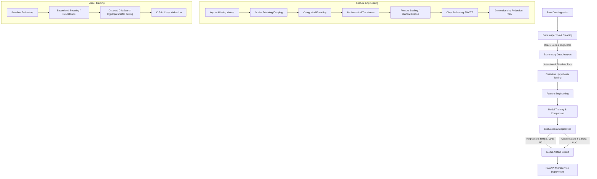

# MLExtraction: End-to-End Machine Learning, Deep Learning, NLP & MLOps Repository

[](https://www.python.org/)
[](https://scikit-learn.org/)
[](https://www.tensorflow.org/)
[](https://fastapi.tiangolo.com/)
[](https://opencv.org/)
[](https://huggingface.co/)

A comprehensive, production-grade repository covering mathematical foundations, exploratory data analysis (EDA), rigorous statistical testing, scratch & library implementations of machine learning algorithms, deep learning (Computer Vision & NLP), advanced feature engineering, concurrency tools, and MLOps API deployments.

---

## Table of Contents

- [Project Overview](#project-overview)
- [Repository Structure](#repository-structure)
- [Core Modules & Detailed Breakdown](#core-modules--detailed-breakdown)
  - [1. Statistical Foundations & Hypothesis Testing (`stats/`)](#1-statistical-foundations--hypothesis-testing-stats)
  - [2. Exploratory Data Analysis (`EDA/`)](#2-exploratory-data-analysis-eda)
  - [3. Feature Engineering & Preprocessing (`feature_engineering/`)](#3-feature-engineering--preprocessing-feature_engineering)
  - [4. Core ML Algorithms & Scratch Implementations (`Algorithms/`)](#4-core-ml-algorithms--scratch-implementations-algorithms)
  - [5. Metrics & Error Evaluation (`metrics_and_erros/`)](#5-metrics--error-evaluation-metrics_and_erros)
  - [6. Deep Learning, Computer Vision & NLP (`practical_coding/`)](#6-deep-learning-computer-vision--nlp-practical_coding)
  - [7. Production Utilities & Concurrency (`Tools/`)](#7-production-utilities--concurrency-tools)
- [End-to-End ML Execution Workflow](#end-to-end-ml-execution-workflow)
- [Setup & Installation Guide](#setup--installation-guide)
- [Quickstart & Usage Examples](#quickstart--usage-examples)
- [Algorithm & Metric Quick Reference](#algorithm--metric-quick-reference)
- [Contributing & Best Practices](#contributing--best-practices)

---

## Project Overview

**MLExtraction** is built as a complete reference and experimentation suite for data scientists and ML engineers. It bridges the gap between:
1. **Mathematical Underpinnings**: First-principle mathematics, statistical inference, and scratch derivations (e.g., Gradient Descent variants, OLS Linear Regression, Perceptron, K-Means).
2. **Applied Data Science**: Robust data cleaning, handling multicollinearity, class imbalance (SMOTE), outlier remediation, transformation pipelines, and Bayesian hyperparameter tuning with Optuna.
3. **Advanced Deep Learning**: Convolutional Neural Networks (CNNs), transfer learning, NLP text classification with LSTMs/GRUs, Attention/Transformer models (BERT), and OpenCV computer vision pipelines.
4. **Engineering & MLOps**: High-throughput concurrency (`multithreading`, `multiprocessing`, `concurrent.futures`), industrial logging frameworks, and production-ready microservices with **FastAPI** and **Pydantic**.

---

## Repository Structure

```tree
MLExtraction/
├── Algorithms/                      # ML algorithms implemented from scratch & via scikit-learn
│   ├── Ensemble_models/             # Voting, Bagging, Pasting, Stacking Classifiers
│   ├── Gradient_Descent/            # Batch, Stochastic, and Mini-Batch GD from scratch
│   ├── Logistic_Regression/         # Perceptrons, Softmax & Polynomial Classifiers
│   ├── Regression/                  # Simple LR & Multiple LR (Scratch + OLS + Sklearn)
│   ├── Unsupervised/                # K-Means (from scratch + WCSS), Agglomerative, DBSCAN
│   └── tree_models/                 # Decision Trees & Random Forest visualizers
│
├── EDA/                             # Exploratory Data Analysis notebooks & visualization helpers
│   ├── univariate analysis.ipynb    # Distributions, boxplots, countplots, outliers
│   ├── BiVariate analysis.ipynb     # Correlation heatmaps, pairplots, scatter, jointplots
│   └── help.py                      # Reusable charting helper functions
│
├── feature_engineering/             # Feature transformation and preprocessing pipelines
│   ├── Imputation-missing_values.ipynb # Simple, KNN, Iterative Imputers & Indicators
│   ├── Scaling .ipynb               # StandardScaler, MinMaxScaler, RobustScaler, MaxAbsScaler
│   ├── Encoding .ipynb              # One-Hot, Ordinal, Label Encoding & Dummies
│   ├── Outliers removal.ipynb       # IQR filtering, Z-score trimming & capping
│   ├── PCA.ipynb                    # Dimensionality Reduction via Principal Component Analysis
│   ├── imbalanced_data _SMOTE.ipynb # Oversampling via SMOTE & class weighting
│   ├── optuna_hyperparameter_tuning.ipynb # Automated Bayesian hyperparameter search
│   ├── roc_auc_curve.ipynb          # Sensitivity, Specificity, ROC-AUC curve plotting
│   └── transformations.ipynb        # Log, Box-Cox, Yeo-Johnson & Power transforms
│
├── metrics_and_erros/               # Model evaluation metrics & loss functions
│   └── Regression Metrics and Errors.ipynb # MAE, MSE, RMSE, R2, Adjusted R2
│
├── stats/                           # Theoretical and applied inferential statistics
│   ├── 1_PDF_CDF_stats.ipynb        # Probability Density & Cumulative Distribution
│   ├── 2_KDE_stats.ipynb            # Kernel Density Estimation
│   ├── 3_Normal_Distribution_stats.ipynb # Gaussian distribution properties, 68-95-99.7 rule
│   ├── 4_Binomial Dist_stats.ipynb  # Discrete binomial distributions & Bernoulli trials
│   ├── 5_Central Limit Theorem_stats.ipynb # CLT sampling distributions
│   ├── 6_Confidence Interval .ipynb # Standard Error, Margin of Error & CI estimation
│   ├── 7_single sample t-test.ipynb # One-sample Student's t-test
│   ├── 8_two_sample t-test.ipynb   # Independent two-sample t-test
│   └── 9_Paired 2 sample ttest.ipynb # Paired/dependent sample hypothesis testing
│
├── practical_coding/                # Applied Deep Learning, CV, NLP & MLOps
│   ├── computer_vision_coding/      # CNNs, ShallowNet, Transfer Learning, Haar Cascades, OpenCV
│   │   ├── opencv_transformations/  # Color spaces, filters, cartoonization, video stream
│   │   ├── HaarCascade_ObjectDetection/ # Face & object detection
│   │   └── Pkgs_Image/              # Image manipulation packages
│   ├── dl_coding/                   # Batch Normalization, Dropout, Callbacks, Keras Tuner
│   ├── ml_coding/                   # Cross-validation, K-Fold, GridSearch, Pandas Profiling
│   ├── nlp_dl_coding/               # Tokenization, TF-IDF, Word2Vec, LSTMs, GRUs, BERT
│   │   ├── bert_and_transformers/   # HuggingFace NER, Paraphrase Transformers
│   │   └── text_classification_deep_learning_projects/ # Sentiment analysis, IMDB, Reuters
│   └── MLOPS/                       # Production deployment pipelines
│       └── pydantic_fastapi/        # FastAPI REST API with Pydantic validation & CRUD
│
├── Tools/                           # System tools, performance optimization & logging
│   ├── logging/                     # Stream & rotating file loggers, multi-logger architecture
│   └── multithreading_Garbage_collection/ # Threading, Multiprocessing & ProcessPoolExecutor
│
├── stepbystepguide.txt              # Comprehensive cheat sheet & ML rules of thumb
└── README.md                        # Master Documentation
```

---

## Core Modules & Detailed Breakdown

### 1. Statistical Foundations & Hypothesis Testing (`stats/`)
Rigorous statistics forms the bedrock of data understanding and feature significance.
- **Probability Distributions**: Exploration of Continuous (Normal, Log-Normal) and Discrete (Binomial, Bernoulli) distributions.
- **Density Functions**: Interactive derivations and plotting of **Probability Density Functions (PDF)**, **Cumulative Distribution Functions (CDF)**, and **Kernel Density Estimation (KDE)**.
- **Central Limit Theorem (CLT)**: Empirical demonstration that sample means approach a Gaussian distribution regardless of parent population shape as $N \to \infty$.
- **Hypothesis Testing**:
  - **One-Sample $t$-test**: Testing sample mean against known population mean.
  - **Two-Sample Independent $t$-test**: Evaluating significant differences between two independent groups.
  - **Paired Two-Sample $t$-test**: Pre/post treatment comparison on the same subject group.

---

### 2. Exploratory Data Analysis (`EDA/`)
Visualizing data characteristics before running algorithms:
- **Univariate Analysis**: Analyzing single-variable spread via Histograms, KDE distplots, Boxplots (detecting IQR outliers), Countplots, and Pie charts.
- **Bivariate & Multivariate Analysis**: Detecting feature-to-target dependencies and inter-feature multicollinearity via Scatter plots, Correlation Heatmaps, Seaborn Clustermaps, FacetGrids, and Pair plots.
- **Helper Scripts**: Modular plotting utilities in [EDA/help.py](file:///Users/riteshpandey/Desktop/programs%202.c/MLExtration/EDA/help.py).

---

### 3. Feature Engineering & Preprocessing (`feature_engineering/`)
Transforming raw data into high-signal feature vectors:
- **Missing Data Strategies**:
  - Unconditional Dropping vs. `SimpleImputer` (Mean, Median, Most Frequent).
  - Advanced Imputation: `KNNImputer` (Euclidean nearest neighbors) and `IterativeImputer` (MICE - Multivariate Imputation by Chained Equations).
  - `MissingIndicator` flags for preserving missingness signal.
- **Scaling & Normalization**:
  - `StandardScaler`: Zero-mean, unit-variance ($z = \frac{x - \mu}{\sigma}$).
  - `MinMaxScaler`: Bound features between $[0, 1]$.
  - `RobustScaler`: Scaled using Median and IQR to resist severe outliers.
  - `MaxAbsScaler` & Mean Normalization.
- **Encoding Techniques**: `OneHotEncoder` (nominal with low cardinality), `OrdinalEncoder` / `LabelEncoder` (ordered categorical data), and Pandas `get_dummies` handling dummy variable traps ($k-1$).
- **Outlier Remediation**: Trimming and winsorization / capping using 1.5 $\times$ IQR thresholds and 3$\sigma$ Z-score cutoffs.
- **Dimensionality Reduction**: Principal Component Analysis (**PCA**) for orthogonal variance maximization and projection into lower-dimensional sub-spaces.
- **Class Balancing**: Synthetic Minority Over-sampling Technique (**SMOTE**) to balance skewed target classes.
- **Hyperparameter Optimization**: Automated Bayesian hyperparameter search using **Optuna** (TPE sampler, pruning callbacks) outperforming manual Grid/Random searches.

---

### 4. Core ML Algorithms & Scratch Implementations (`Algorithms/`)
Understanding internal mechanics by implementing core algorithms from scratch alongside production scikit-learn counterparts:
- **Linear & Polynomial Regression**:
  - Closed-form Ordinary Least Squares (OLS) Normal Equation: $\theta = (X^T X)^{-1} X^T y$.
  - Simple Linear Regression & Multiple Linear Regression from scratch.
  - Regularization models: **Ridge ($L_2$)**, **Lasso ($L_1$)**, and **ElasticNet**.
- **Gradient Descent Optimization**:
  - **Batch Gradient Descent**: Updates parameters using the entire dataset per epoch.
  - **Stochastic Gradient Descent (SGD)**: Fast parameter updates per single sample.
  - **Mini-Batch Gradient Descent**: Vectorized batch updates balancing convergence speed and stability.
- **Classification & Linear Decision Boundaries**:
  - Perceptron learning algorithm from first principles.
  - Softmax Regression for multi-class classification.
- **Tree-Based Models**:
  - Decision Trees (Gini Impurity, Information Gain / Entropy, Tree pruning, feature importance visualization).
  - Random Forests (Bootstrap Aggregation + Random Feature Subspacing).
- **Ensemble Architectures**:
  - **Voting Ensemble**: Hard and Soft probability averaging across diverse estimators.
  - **Bagging & Pasting**: Parallel bootstrapping to reduce model variance.
  - **Stacking Classifier**: Multi-layer stacked ensemble with cross-validated meta-learners.
  - **Boosting**: Sequential error reduction (AdaBoost, Gradient Boosting, XGBoost principles).
- **Unsupervised Clustering**:
  - **K-Means from scratch**: Centroid initialization, distance computation, iterative cluster assignment, and WCSS (Within-Cluster Sum of Squares) Elbow method.
  - **Agglomerative Hierarchical Clustering**: Dendrogram construction and linkage criteria (Ward, Complete, Average).
  - **DBSCAN**: Density-based spatial clustering with core points, border points, and noise filtering ($\epsilon$ radius and `min_samples`).

---

### 5. Metrics & Error Evaluation (`metrics_and_erros/`)
- **Continuous Metrics**:
  - **Mean Absolute Error (MAE)**: $\frac{1}{n} \sum |y_i - \hat{y}_i|$ (robust to outliers).
  - **Mean Squared Error (MSE)**: Penalizes large deviations quadratically.
  - **Root Mean Squared Error (RMSE)**: Interpretable in original target units.
  - **$R^2$ Score & Adjusted $R^2$**: Proportion of variance explained, with penalty terms for redundant regressors ($1 - \frac{(1-R^2)(n-1)}{n-k-1}$).
- **Discrete & Classification Metrics**:
  - Confusion Matrix, Precision, Recall, $F_1$-Score, and Macro/Weighted averages.
  - Receiver Operating Characteristic (**ROC**) and Area Under Curve (**AUC**).

---

### 6. Deep Learning, Computer Vision & NLP (`practical_coding/`)

#### Deep Learning Architecture & Training (`dl_coding/`)
- **Deep Neural Networks**: Implementation of Dense Feedforward Networks using TensorFlow/Keras.
- **Training Regularization**: Batch Normalization, Dropout layers, Early Stopping callbacks with model checkpointing, Learning Rate Schedulers.
- **Hyperparameter Search**: Tuning neural architectures with **Keras Tuner** (Hyperband & RandomSearch).

#### Computer Vision (`computer_vision_coding/`)
- **CNN Architectures**: End-to-end convolutional pipelines on Fashion-MNIST, ShallowNet architectures, Rock-Paper-Scissors classification with dropout.
- **Data Augmentation**: `ImageDataGenerator` with real-time zooming, shear, rotation, and horizontal flips.
- **Transfer Learning**: Fine-tuning pre-trained feature extractors.
- **Image Processing & Detection**:
  - OpenCV color conversions, kernel filters, morphological operations, cartoonization filters, real-time camera capture.
  - Haar Cascade classifiers for real-time face and feature detection.

#### Natural Language Processing & LLM Foundations (`nlp_dl_coding/`)
- **Text Preprocessing & Feature Extraction**: Tokenization, Stopwords removal, Lemmatization, Bag of Words, TF-IDF vectorization, N-grams.
- **Vector Representations**: Word2Vec (Skip-Gram & CBOW), FastText, Word Embeddings.
- **Sequence Modeling**: Recurrent Neural Networks (RNNs), Long Short-Term Memory (**LSTM**) networks, and Gated Recurrent Units (**GRU**) for sarcasm and sentiment analysis (IMDB, Amazon Alexa reviews).
- **1D Convolutions for Text**: Fast feature extraction using `Conv1D` and `GlobalMaxPooling1D`.
- **Transformers & Modern NLP**: Hugging Face pipeline integration, BERT-based Named Entity Recognition (NER), Paraphrase Transformers, and Topic Modeling with Latent Dirichlet Allocation (LDA).

#### MLOps & API Deployment (`MLOPS/pydantic_fastapi/`)
- **Production API Framework**: RESTful API endpoints written in **FastAPI**.
- **Data Contract & Validation**: Strict type-enforcement and validation using **Pydantic** schemas.
- **CRUD Operations**: Structured user management and model inference endpoints with JSON persistence.

---

### 7. Production Utilities & Concurrency (`Tools/`)
- **High-Performance Concurrency**:
  - Multi-threading for I/O-bound operations (`threading`, `concurrent.futures.ThreadPoolExecutor`).
  - Multi-processing for CPU-bound computations (`multiprocessing`, `concurrent.futures.ProcessPoolExecutor`).
  - Python Memory Management & Garbage Collection (`gc` module optimization).
- **Industrial Logging**:
  - Hierarchical logging configurations.
  - Simultaneous file-stream handlers with automated log rotation (`RotatingFileHandler`).
  - Segregated multi-logger systems for data ingestion, training pipelines, and API services.

---

## End-to-End ML Execution Workflow

The repository follows a standardized, battle-tested ML development lifecycle:



---

## Setup & Installation Guide

### Prerequisites
- Python 3.8, 3.9, 3.10, or 3.11
- Virtual environment manager (`venv` or `conda`)

### 1. Clone the Repository
```bash
git clone https://github.com/riteshpandey2024-cyber/MLExtraction.git
cd MLExtraction
```

### 2. Create and Activate a Virtual Environment
```bash
# Using venv (macOS/Linux)
python3 -m venv venv
source venv/bin/activate

# On Windows
python -m venv venv
venv\Scripts\activate
```

### 3. Install Required Dependencies
```bash
pip install --upgrade pip
pip install numpy pandas scipy scikit-learn matplotlib seaborn \
            tensorflow keras keras-tuner opencv-python optuna \
            nltk spacy transformers datasets fasttext-wheel \
            fastapi uvicorn pydantic jupyterlab
```

---

## Quickstart & Usage Examples

### 1. Running the FastAPI MLOps Service
Navigate to the MLOps directory and launch the server via `uvicorn`:
```bash
cd "practical_coding/MLOPS/pydantic_fastapi"
uvicorn main:app --reload --port 8000
```
Open your browser and visit the interactive Swagger UI:
- **Interactive Docs**: [http://127.0.0.1:8000/docs](http://127.0.0.1:8000/docs)
- **ReDoc**: [http://127.0.0.1:8000/redoc](http://127.0.0.1:8000/redoc)

### 2. Running Jupyter Notebooks
To explore any module interactively:
```bash
jupyter lab
```

### 3. Executing Concurrency & Logging Tools
```bash
# Test multi-threading and process pool executors
python "Tools/multithreading_Garbage_collection/3_thread_pool_executor.py"
python "Tools/multithreading_Garbage_collection/4_pool_executor.py"

# Run advanced logging stream
python "Tools/logging/file_stream_3.py"
```

---

## Algorithm & Metric Quick Reference

| Problem Type | Algorithm / Method | Implementation Type | Key Evaluation Metric |
| :--- | :--- | :--- | :--- |
| **Regression** | Simple & Multiple Linear Regression | Scratch & Scikit-Learn | RMSE, $R^2$, Adjusted $R^2$ |
| **Regression** | Ridge ($L_2$), Lasso ($L_1$), ElasticNet | Scikit-Learn | Cross-Validated MSE |
| **Classification** | Perceptron & Softmax Regression | Scratch & Scikit-Learn | Accuracy, Log-Loss |
| **Classification** | Decision Trees, Random Forest | Scikit-Learn & Tree Visualizer | Precision, Recall, $F_1$-Score |
| **Ensemble** | Voting, Bagging, Stacking | Scikit-Learn Ensembles | ROC-AUC, $F_1$-Score |
| **Clustering** | K-Means | From Scratch & Scikit-Learn | WCSS (Elbow), Silhouette Score |
| **Clustering** | Agglomerative & DBSCAN | Scikit-Learn & SciPy | Dendrogram Linkage, Silhouette |
| **Computer Vision** | CNN, ShallowNet, Transfer Learning | TensorFlow / Keras | Categorical Accuracy |
| **NLP** | Word2Vec, LSTMs, GRUs, BERT | Keras & HuggingFace | Classification Report, Perplexity |
| **Optimization** | Optuna TPE & Keras Tuner | Bayesian Optimization | Objective Metric Validation Loss |

---

## Contributing & Best Practices

1. **Keep Code Modular**: Use reusable helper functions in `.py` modules rather than duplicating notebook cells.
2. **Follow PEP 8**: Maintain clean variable naming, docstrings, and type hints where applicable.
3. **Validate Transformations**: When performing data transformations, always fit transformers on the **Training set only** and transform both **Train and Test** to avoid data leakage.
4. **Log Appropriately**: Utilize Python's standard `logging` library instead of raw `print` statements in production scripts.

---

<div align="center">
  <sub>Built for Machine Learning Researchers, Practitioners, and Engineers.</sub>
</div>
